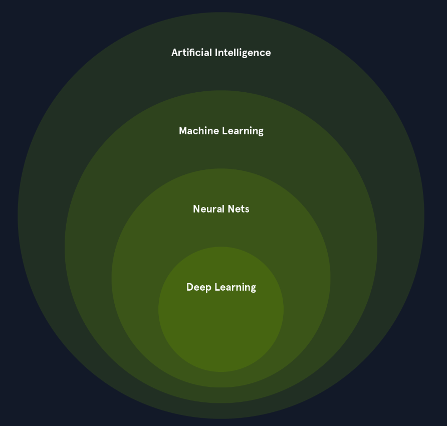

# Introducción al Aprendizaje Automático

# `Inteligencia Artificial` (`AI)`

Los sistemas de `AI` están diseñados para mejorar la toma de decisiones y la productividad humanas, brindando apoyo en el análisis de datos complejos, la predicción y las tareas mecánicas.

- `Procesamiento del Lenguaje Natural` (`NLP`): permite a las computadoras comprender, interpretar y generar el lenguaje humano.
- `Visión por Computadora`: permite a las computadoras "ver" e interpretar imágenes y videos.
- `Robótica`: desarrolla robots que pueden realizar tareas de forma autónoma o con guía humana.
- `Sistemas Expertos`: crea sistemas que imitan las capacidades de toma de decisiones de los expertos humanos.

# **`Aprendizaje Automático (ML - Machine Learning)`**

 Los algoritmos de ML utilizan técnicas estadísticas para identificar patrones, tendencias y anomalías dentro de los conjuntos de datos, lo que permite al sistema realizar predicciones, tomar decisiones o hacer clasificaciones basadas en nuevos datos de entrada.

El ML se puede clasificar en tres tipos principales:

1. `Aprendizaje Supervisado` :  aprende de ejemplos que ya tienen la respuesta correcta (datos etiquetados).
    
    Ejemplos:
    
    - 🖼️ Clasificación de imágenes
    - 📧 Detección de spam
    - 💳 Prevención de fraude
2. `Aprendizaje No Supervisado` :  aprende de datos sin etiquetas, buscando patrones o grupos ocultos por sí mismo.
    
    Ejemplos:
    
    - 👥 Segmentación de clientes
    - 🚨 Detección de anomalías
    - 📉 Reducción de la dimensionalidad
3. `Aprendizaje por Refuerzo :` aprende por prueba y error, interactuando con un entorno y recibiendo recompensas o castigos.
    
    Ejemplos:
    
    - 🎮 Juegos
    - 🦾 Robótica
    - 🚗 Conducción autónoma

# **`Aprendizaje Profundo (DL - Deep Learning)`**

 Es un subcampo del ML que utiliza redes neuronales con múltiples capas para aprender y extraer características de datos complejo

Las características clave del DL incluyen:

- `Aprendizaje Jerárquico de Características`: Aprende por capas, de lo simple a lo complejo. Ej: en imágenes, las primeras capas detectan bordes → las siguientes detectan formas
- `Aprendizaje de Extremo a Extremo`: Le das los datos crudos (sin procesar) y él solo aprende a llegar directo al resultado, sin que un humano tenga que
preparar/seleccionar características a mano.
- `Escalabilidad`:  Mientras más datos y más poder de cómputo le des, mejor rinde. Por eso es ideal para big data.

Los tipos comunes de redes neuronales utilizadas en DL incluyen:

- `Redes Neuronales Convolucionales` (`CNNs`): especializadas en datos de imagen y video, las CNN utilizan capas convolucionales para detectar patrones locales y jerarquías espaciales.
- `Redes Neuronales Recurrentes` (`RNNs`): diseñadas para datos secuenciales como texto y voz, las RNN tienen bucles que permiten que la información persista a través de los pasos de tiempo.
- `Transformers`:  los transformers son particularmente efectivos para tareas de procesamiento del lenguaje natural. Aprovechan los mecanismos de autoatención para manejar dependencias de largo alcance.

El DL ha revolucionado muchas áreas de la AI, logrando un rendimiento de vanguardia en tareas como:

- `Visión por Computadora`: clasificación de imágenes, detección de objetos, segmentación de imágenes
- `Procesamiento del Lenguaje Natural` (`NLP`): análisis de sentimientos, traducción automática, generación de texto
- `Reconocimiento de Voz`: transcripción de audio a texto, síntesis de voz
- `Aprendizaje por Refuerzo`: entrenamiento de agentes para tareas complejas como jugar y controlar robots

# **Repaso de matemáticas para IA**

  Álgebra Lineal — Vectores y Matrices

Logaritmos

 Autovalores y Autovectores

Probabilidad y Estadística

# **Algoritmos de aprendizaje supervisado**

**Datos de entrenamiento**

 Este conjunto de datos consta de características de entrada y sus correspondientes etiquetas de salida. La calidad y la cantidad de los `datos de entrenamiento` influyen significativamente en la precisión del modelo y en su capacidad para generalizar a datos nuevos y no vistos.

# **Etiquetas**

Las `etiquetas` (`Labels`) son los resultados conocidos o las variables objetivo asociadas a cada punto de datos en el conjunto de entrenamiento. Representan las «respuestas correctas» que el modelo pretende predecir.

# **Modelo**

Un `modelo` (`model`) es una representación matemática de la relación entre las características y las etiquetas. Se aprende a partir de los datos de entrenamiento y se utiliza para predecir datos nuevos y no vistos. El `modelo` puede considerarse una función que toma las características como entrada y produce una predicción para la etiqueta.

**Regresión lineal**

Imagina que intentas predecir el precio de una casa basándote en su tamaño. La regresión lineal intentaría encontrar una línea recta que capture mejor la relación entre estas dos variables. A medida que aumenta el tamaño de la casa, el precio generalmente tiende a aumentar. La regresión lineal cuantifica esta relación, lo que nos permite predecir el precio de una casa dado su tamaño.

**Regresión logística**

Por ejemplo, la regresión logística puede predecir si un correo electrónico es spam o no, o si un cliente hará clic en un anuncio. El algoritmo modela la probabilidad de que la variable objetivo pertenezca a una clase concreta utilizando una función logística, que asigna las características de entrada a un valor entre 0 y 1.

# **Detección de spam**

Supongamos que estamos creando un filtro de spam utilizando la `regresión logística`. El algoritmo analizaría varias características del correo electrónico, como la dirección del remitente, la presencia de ciertas palabras clave y el contenido del correo, para calcular una puntuación de probabilidad. El correo electrónico se clasificará como spam si la puntuación supera un umbral predefinido (por ejemplo, 0.8).

**Umbral de probabilidad**

Por ejemplo, en la detección de spam, si el modelo predice que un correo electrónico tiene una probabilidad de 0.8 de ser spam (y el umbral es 0.5), se clasifica como spam. Ajustar el umbral a 0.6 requeriría una mayor probabilidad para que el correo electrónico fuera clasificado como spam.

**Árboles de decisión**

Imagina que intentas decidir si jugar al tenis basándote en el tiempo. Un árbol de decisión desglosaría esta decisión en una serie de preguntas sencillas: ¿Hace sol? ¿Hace viento? ¿Hay humedad? En función de las respuestas a estas preguntas, el árbol te llevaría a una decisión final: jugar al tenis o no jugar al tenis.

# **Algoritmos de aprendizaje no supervisado**

Exploran datos no etiquetados, donde el objetivo no es predecir un resultado específico, sino descubrir patrones, estructuras y relaciones ocultas dentro de los dato

Piense en ello como si explorara una ciudad nueva sin un mapa. Usted observa el entorno, identifica puntos de referencia y nota cómo se conectan las diferentes áreas. De manera similar, los algoritmos de `Unsupervised learning` analizan las características inherentes de los datos para descubrir estructuras y patrones ocultos.

**Datos no etiquetados**

Piense en ello como analizar una colección de fotografías sin pies de foto ni descripciones. Incluso sin conocer el contexto específico de cada foto, se pueden agrupar fotos similares basándose en características visuales como el color, la composición y el tema.

|  |  Supervisado     |   No supervisado |
| --- | --- | --- |
| Datos   |  Con etiquetas (respuesta conocida) |  Sin etiquetas  |
| Objetivo |  Predecir una etiqueta específica  | Encontrar estructura/patrones ocultos  |
| Encontrar estructura/patrones ocultos  |  Clasificar spam |  Agrupar clientes similares (clustering) |

# **Análisis de Componentes Principales (PCA)**

El PCA se utiliza ampliamente para la `extracción de características` (feature extraction), la visualización de datos y la `reducción de ruido` (noise reduction).
Por ejemplo, en el procesamiento de imágenes, el PCA puede reducir la dimensionalidad de los datos de una imagen al identificar los componentes principales que capturan las características más importantes de las imágenes, como los bordes, las texturas y las formas.

Considera una base de datos de imágenes faciales. El PCA se puede utilizar para identificar los componentes principales que capturan las variaciones más significativas en los rasgos faciales, como la forma de los ojos, el tamaño de la nariz y el ancho de la boca. Al proyectar las imágenes faciales en un espacio de menor dimensionalidad definido por estos componentes principales, podemos buscar de manera eficiente rostros similares.

**Detección de anomalías**

La `detección de anomalías`, también conocida como detección de valores atípicos (outlier detection), es crucial en el `aprendizaje no supervisado` (unsupervised learning). Identifica los puntos de datos que se desvían significativamente del comportamiento normal dentro de un conjunto de datos. Estos puntos de datos anómalos, a menudo llamados valores atípicos (outliers), pueden indicar eventos críticos, como actividades fraudulentas, fallos del sistema o emergencias médicas.

Piense en ello como un sistema de seguridad que vigila un edificio. El sistema aprende los patrones de actividad normales, como la gente que entra y sale durante el horario laboral. Activa una alarma si detecta algo inusual, como alguien que intenta entrar por la noche. Del mismo modo, los algoritmos de detección de anomalías aprenden los patrones normales en los datos y marcan cualquier desviación como una posible anomalía.

# **Algoritmos de aprendizaje por refuerzo**

 A diferencia del `aprendizaje supervisado` (`supervised learning`), que se basa en datos etiquetados, o del `aprendizaje no supervisado` (`unsupervised learning`), que explora datos sin etiquetar, el `RL` se centra en aprender mediante el método de ensayo y error, guiado por una retroalimentación en forma de recompensas o penalizaciones.

## Agente

El `agente` (`agent`) es el aprendiz y el encargado de tomar decisiones en un sistema de `RL`. Interactúa con el entorno, realizando acciones y observando las consecuencias. El objetivo del agente es aprender una política óptima que maximice las recompensas acumuladas a lo largo del tiempo.

Piense en el `agente` como un robot que recorre un laberinto, un programa que juega a un videojuego o un coche autónomo que circula por el tráfico. En cada caso, el `agente` toma decisiones y aprende de sus experiencias.

# **Introducción al aprendizaje profundo (Deep Learning)**

Utiliza redes neuronales artificiales con múltiples capas (de ahí el término «profundo» o «deep») para analizar datos y aprender patrones complejos.  Estas redes se inspiran en la estructura y el funcionamiento del cerebro humano, lo que les permite alcanzar un rendimiento notable en diversas tareas.

**Motivación detrás del aprendizaje profundo**

El aprendizaje profundo ha surgido como una tecnología transformadora que puede revolucionar diversos campos. Su capacidad para resolver problemas complejos e imitar el cerebro humano lo convierte en un motor clave del progreso en la inteligencia artificial.

**Conceptos importantes del aprendizaje profundo**

# **Redes neuronales artificiales (ANN)**

Las `redes neuronales artificiales` (`ANN`) son sistemas computacionales inspirados en las redes neuronales biológicas que constituyen los cerebros de los animales. Una ANN se compone de nodos interconectados o `neuronas` organizadas en capas. Cada conexión entre neuronas tiene un `peso` (weight) asociado, que representa la fuerza de la conexión.

La red aprende ajustando estos pesos en función de los datos de entrada, lo que le permite hacer predicciones o tomar decisiones. Las `ANN` son fundamentales para el aprendizaje profundo, ya que proporcionan el marco para construir modelos complejos que pueden aprender de grandes cantidades de datos.

# **Capas**

Las redes de aprendizaje profundo se caracterizan por su estructura en capas. Hay tres tipos principales de capas:

- `Capa de entrada (Input Layer):` Esta capa recibe los datos de entrada iniciales.
- `Capas ocultas (Hidden Layers):` Estas capas intermedias realizan cálculos y extraen características de los datos. Las redes de aprendizaje profundo tienen múltiples capas ocultas, lo que les permite aprender patrones complejos.
- `Capa de salida (Output Layer):` Esta capa produce la salida final de la red, como una predicción o una clasificación.

# **Retropropagación (Backpropagation)**

La `retropropagación` (backpropagation) es un algoritmo clave utilizado para entrenar redes de aprendizaje profundo. Consiste en calcular el gradiente de la función de pérdida con respecto a los pesos de la red y, a continuación, actualizar los pesos en la dirección que minimiza la pérdida. Este proceso iterativo permite a la red aprender de los datos y mejorar su rendimiento con el tiempo.

# **Hiperparámetros**

Los `hiperparámetros` (hyperparameters) se establecen antes de que comience el entrenamiento y controlan el proceso de aprendizaje. Algunos ejemplos son la tasa de aprendizaje (learning rate), el número de capas ocultas y el número de neuronas en cada capa. Ajustar los hiperparámetros es crucial para lograr un rendimiento óptimo.

# **Las Limitaciones de los Perceptrones**

Los perceptrones de una sola capa solo pueden aprender fronteras de decisión lineales, lo que los hace incapaces de clasificar datos con patrones no lineales.

Un ejemplo clásico es el problema XOR (XOR problem). La función XOR devuelve verdadero (1) si solo una de las entradas es verdadera y falso (0) en caso contrario. Es imposible trazar una única línea recta que separe las salidas verdaderas y falsas de la función XOR. Esta limitación restringe severamente los tipos de problemas que un perceptrón de una sola capa puede resolver.

# **Redes neuronales**

Las `capas ocultas` (hidden layers) son las capas intermedias entre las capas de entrada y salida. Realizan cálculos y extraen características de los datos. Cada neurona en una capa oculta:

1. Recibe la entrada de todas las neuronas de la capa anterior.
2. Realiza una suma ponderada de las entradas.
3. Añade un sesgo a la suma.
4. Aplica una función de activación al resultado.

La salida de cada neurona en una capa oculta se pasa como entrada a la siguiente capa.

Múltiples capas ocultas permiten a la red aprender relaciones complejas no lineales dentro de los datos. Cada capa puede aprender diferentes niveles de abstracción, donde las capas iniciales aprenden características simples y las capas posteriores combinan esas características en representaciones más complejas.

La `capa de salida` (output layer) produce el resultado final de la red. El número de neuronas en la capa de salida depende de la tarea específica:

- Una tarea de clasificación binaria tendría una neurona de salida.
- Una tarea de clasificación multiclase tendría una neurona para cada clase.

# Ejemplo

Para ilustrar esta extracción jerárquica de características, considere el dígito manuscrito "7". La imagen de entrada se procesa a través de múltiples capas convolucionales, cada una de las cuales extrae diferentes niveles de características.

La primera capa convolucional se centra en características de bajo nivel, como bordes y contornos. Por ejemplo, podría detectar los bordes verticales y horizontales que forman el dígito "7".

En esta imagen, se puede ver claramente un enfoque en el contorno y los bordes del número 7. El filtro ha resaltado las transiciones bruscas de intensidad, que corresponden a los límites del dígito.

La segunda capa convolucional se basa en las características extraídas por la primera capa. Combina estas detecciones de bordes para identificar patrones más complejos, como la estructura interior del dígito

Aquí se puede ver un enfoque en el interior del número 7, en lugar de solo los bordes. El filtro ha detectado las líneas continuas y las curvas que forman el dígito, proporcionando una representación más detallada.

Esta extracción jerárquica de características permite a las `CNN` representar información visual compleja de manera estructurada y eficiente. Al basarse en las características aprendidas en las capas anteriores, las capas más profundas pueden capturar representaciones cada vez más abstractas y significativas de los datos de entrada. Es por eso que las `CNN` son tan eficaces en tareas que requieren la comprensión de escenas visuales complejas, como la clasificación de imágenes, la detección de objetos y la segmentación.

# Reconocimiento de imagenes

Para ilustrar este proceso, considere una tarea de reconocimiento de imágenes en la que se entrena una `CNN` para clasificar imágenes de diferentes animales:

1. `Capa de entrada` (`Input Layer`): La entrada es una imagen en bruto, normalmente representada como un tensor 3D (altura, anchura, canales).
2. `Capas convolucionales`:
    - `Capa 1`: Detecta características de bajo nivel como bordes y texturas simples.
    - `Capa 2`: Combina estas características para detectar patrones más complejos, como esquinas y curvas.
    - `Capa 3`: Reconoce estructuras de nivel superior como formas y partes de objetos.
3. `Capas de pooling`:
    - Reducen las dimensiones espaciales de los mapas de características, lo que hace que la red sea menos costosa computacionalmente y más robusta a pequeñas traslaciones en la imagen de entrada.
4. `Capas totalmente conectadas`:
    - Aplanan la salida de la última capa de pooling.
    - Realizan un razonamiento de alto nivel y hacen predicciones basadas en las características extraídas, como clasificar la imagen como un gato, un perro o un pájaro.

# **Estructura de datos en forma de cuadrícula**

- `Imágenes`: Representadas como cuadrículas 2D, donde cada celda de la cuadrícula contiene el valor de un píxel. Las dimensiones suelen incluir la altura, la anchura y los canales (p. ej., rojo, verde, azul).
- `Vídeos`: Representados como cuadrículas 3D, que amplían el concepto de imagen añadiendo una dimensión temporal. Esto da como resultado una estructura de altura, anchura, tiempo y canal.

# **Introducción a la IA generativa**

Se centra en la creación de nuevo contenido o datos que se asemejan a los resultados generados por humanos. A diferencia de los sistemas de IA tradicionales diseñados para reconocer patrones, clasificar datos o hacer predicciones, la `Generative AI` se enfoca en producir contenido original, que abarca desde texto e imágenes hasta música y código.

Imagine a un artista que utiliza sus habilidades e imaginación para crear una pintura. Del mismo modo, los modelos de `Generative AI` aprovechan su conocimiento aprendido para generar resultados nuevos y creativos, que a menudo exhiben una originalidad y un realismo sorprendentes.

# **Modelos de Lenguaje Grandes**

Estos modelos se entrenan con cantidades masivas de datos de texto, lo que les permite aprender patrones y relaciones en el lenguaje. Este conocimiento les permite realizar diversas tareas, como la traducción, el resumen, la respuesta a preguntas y la escritura creativa.

Transformer

- Arquitectura de red neuronal detrás de la mayoría de los LLM.
- Diferencia clave vs. RNN: procesa toda la oración en paralelo (no secuencialmente) → más rápido y eficiente.
- Innovación central: mecanismo de autoatención (self-attention).

 Autoatención (Self-Attention)

- Permite al modelo ponderar la importancia de cada palabra respecto a las demás en una oración.
- Calcula puntuaciones de atención entre cada par de palabras.
- Permite capturar dependencias a largo plazo (relacionar palabras aunque estén lejos una de otra).
- Ejemplo: en "El gato se sentó en la alfombra, que era azul", el modelo entiende que "que" se refiere a "alfombra".

Tokenización

- Paso previo: convertir texto en unidades llamadas tokens.
- Un token puede ser: palabra, subpalabra o carácter (según el modelo).
- Ejemplo: "I love AI" → ["I", "love", "artificial", "intelligence"]

Incrustaciones (Embeddings)

- Cada token se convierte en un vector numérico.
- Capturan el significado semántico: palabras similares → vectores cercanos en el espacio.
- Ejemplo: "rey" y "reina" están más cerca entre sí que "rey" y "mesa".
- Trabajan juntos para comprender y generar lenguaje natural.

Entrenamiento

- Se usan grandes volúmenes de texto con aprendizaje no supervisado (sin etiquetas explícitas).
- El modelo ajusta sus parámetros mediante variantes de descenso de gradiente, minimizando el error entre predicción y texto real.

Ejemplo práctico

- Prompt: "Érase una vez, un gato llamado Whiskers"
- El modelo genera texto palabra por palabra, usando contexto + conocimiento de gramática/semántica para continuar la historia de forma coherente.
- --Idea clave para recordar: "Attention is all you need" → la autoatención es lo que permite a los Transformers entender relaciones entre palabras sin procesar el texto de forma secuencial.

# **Modelos de difusión**

Los modelos de difusión utilizan pasos de adición y eliminación de ruido para aprender la distribución de los datos. Este enfoque ha demostrado ser eficaz en la generación de imágenes, audio y otros tipos de datos realistas.

**Cómo funcionan los modelos de difusión**

